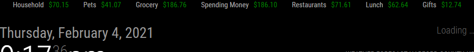

# MMM-YNAB

This is a module for the [MagicMirror²](https://github.com/MichMich/MagicMirror/) which can show remaining dollars in categories from budgets from YNAB.



## Installation ##

1. Run `git clone https://github.com/thesoftwarejedi/MMM-YNAB.git` in the directory `~/MagicMirror/modules`
2. Change directories to the new folder `cd MMM-YNAB` and then run `npm install` 

## Using the module

To use this module, get a YNAB access token for your YNAB account from https://api.youneedabudget.com/, then add the following configuration block to the modules array in the `config/config.js` file:

```js
var config = {
    modules: [
        {
        module: "MMM-YNAB",
        position: "top_bar",
        config: {
            token: "ADD_YNAB_TOKEN_HERE"
            }
        },
    ]
}
```
